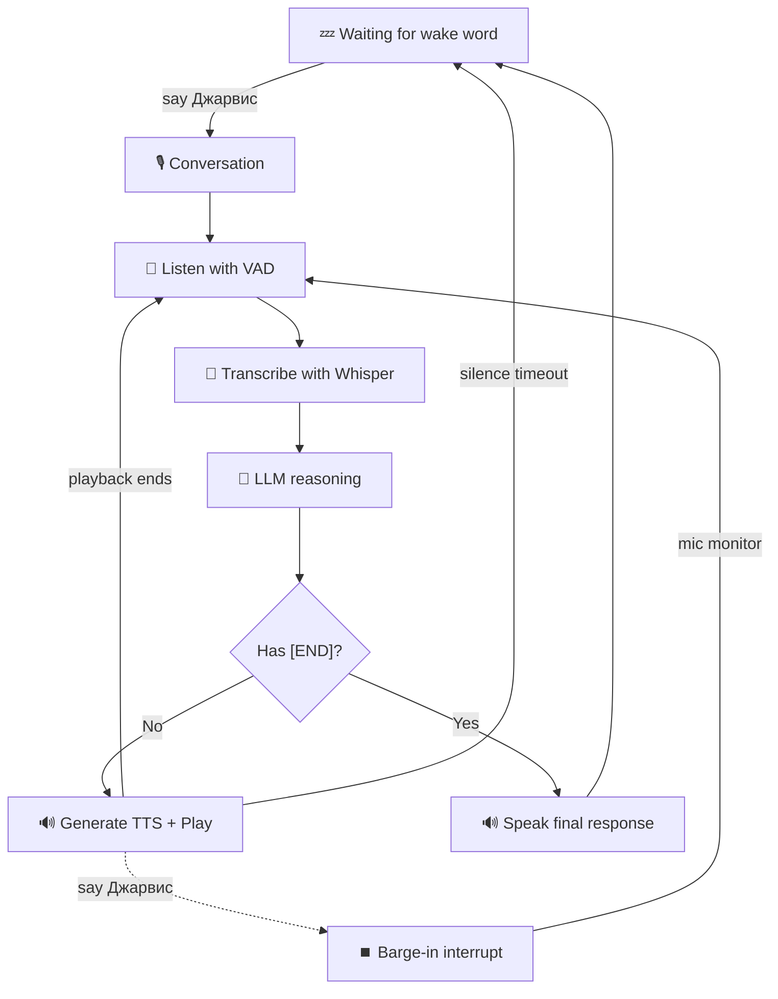

# 🎙️ Jarvis — Voice AI Assistant

A fully offline voice AI assistant for macOS (works on Linux too).  
Speak to it, it talks back. Wake word ("Джарвис"), STT, LLM, TTS — all local.

## Features

- **Wake word activation** — Say "Джарвис" to wake the assistant (offline, Vosk)
- **Voice Activity Detection (VAD)** — Automatically starts/stops recording based on silence
- **Speech-to-Text** — Local transcription via faster-whisper
- **LLM reasoning** — Any OpenAI-compatible API (LM Studio or Ollama)
- **Text-to-Speech** — Multiple backends: macOS `say` (offline, built-in), `edge-tts` (online, best quality), `espeak-ng` (offline, cross-platform)
- **Continuous barge-in** — Say "Джарвис" at any time to interrupt — during LLM thinking, TTS generation, or playback
- **Conversation history integrity** — Interrupted turns leave no trace in history. The LLM always sees a clean, sequential conversation
- **Rolling pre-wake buffer** — Speech right before the wake word is preserved, not lost
- **Conversation control** — LLM decides when the conversation is done (via `[END]` marker)
- **Sleep timeout** — Returns to wake-word listening after inactivity

## Demo

```
--- Jarvis Voice AI Assistant ---
Initializing modules...
🔊 Vosk model loaded | Wake words: джарвис
System ready. Provider: lmstudio | Model: google/gemma-4-12b-qat
Say 'Jarvis' or 'Джарвис' to wake me up.
💤 Waiting... (say: Джарвис)

🔊 Wake word detected!
🎙️ Conversation started. Say 'Джарвис' to interrupt me.

🎤 Listening (VAD, silence timeout: 1.5s)...
   🔴 Listening...
   ✅ Done
📝 Transcribing...
You: привет
🧠 Thinking...
Jarvis: Здравствуйте! Чем я могу вам помочь?
🎤 Listening (VAD, silence timeout: 1.5s)...
```

## Prerequisites

- **Python 3.10+** (managed with [uv](https://docs.astral.sh/uv/))
- **LM Studio** or **Ollama** (or any OpenAI-compatible API) — for LLM
- **Internet connection** — only needed for `edge-tts` or first-time model downloads

## Setup

### 1. Install dependencies

```bash
cd jarvis
uv sync
```

This installs all Python packages from `pyproject.toml`.

### 2. Download Vosk model

The wake word detector uses a Russian Vosk model. Download it:

```bash
# Option A: curl
curl -L -o vosk-model-small-ru-0.22.zip \
  https://alphacephei.com/vosk/models/vosk-model-small-ru-0.22.zip
unzip vosk-model-small-ru-0.22.zip
rm vosk-model-small-ru-0.22.zip

# Option B: wget
wget https://alphacephei.com/vosk/models/vosk-model-small-ru-0.22.zip
unzip vosk-model-small-ru-0.22.zip
rm vosk-model-small-ru-0.22.zip
```

The model directory (`vosk-model-small-ru-0.22/`) should be in the project root.

> Other Vosk models: https://alphacephei.com/vosk/models

### 3. Configure environment

Copy the template and edit:

```bash
cp .env.example .env
```

Then edit `.env` with your settings. See **Quick Start** below for typical configs.

### 4. Choose your TTS backend

Jarvis supports several TTS backends. For **fully offline operation**, use macOS `say`:

| Backend | Online | Quality | Platform |
|---------|--------|---------|----------|
| `say`   | ❌ Offline | ★★★ Good | macOS only (built-in) |
| `edge`  | ⚠️ Internet | ★★★★ Best | Cross-platform |
| `espeak`| ❌ Offline | ★★ Robotic | Cross-platform (install espeak-ng) |
| `yandex`| ⚠️ Internet | ★★★★ Best | Requires Yandex Cloud API key |
| `print` | ❌ Offline | — | No audio, debug only |

**Fully offline config (macOS):**

```env
TTS_BACKEND=say
TTS_VOICE=Milena
```

The `say` command is built into macOS and works completely offline.
List available Russian voices: `say -v '?' | grep ru`

**Online (best quality):**

```env
TTS_BACKEND=edge
TTS_VOICE=ru-RU-SvetlanaNeural
```

**Cross-platform offline (robotic but works everywhere):**

```bash
# Install espeak-ng first:
#   brew install espeak-ng       (macOS)
#   apt install espeak-ng        (Linux)

# Then in .env:
TTS_BACKEND=espeak
TTS_VOICE=ru
```

### 5. Start the LLM server

**Option A — LM Studio:**
1. Open LM Studio, load your model (e.g. `google/gemma-4-12b-qat`)
2. Go to **Local Server** tab → click **Start Server** (default port: 1234)
3. Verify: `curl http://localhost:1234/v1/models`

**Option B — Ollama (Docker):**
```bash
docker run -d --name jarvis-ollama -p 11434:11434 -v ollama_data:/root/.ollama ollama/ollama
docker exec jarvis-ollama ollama pull gemma3:12b
# Set LLM_BASE_URL=http://localhost:11434/v1 in .env
```

### 6. Run Jarvis

```bash
uv run jarvis
```

## Docker Compose Setup

Two deployment modes are available depending on your OS.

### Option A: macOS — LLM in Docker, app on host (recommended)

Docker on macOS **cannot** access the host microphone. The app runs on the host
and connects to Ollama (LLM server) running in Docker.

```bash
# 1. Start the LLM server (Ollama) in Docker:
docker compose -f docker-compose.yml -f docker-compose.macos.yml up -d ollama

# 2. Pull a model:
docker compose exec ollama ollama pull gemma3:12b

# 3. Update .env:
#    LLM_BASE_URL=http://localhost:11434/v1
#    LLM_API_KEY=ollama
#    LLM_MODEL=gemma3:12b

# 4. Run Jarvis on the host (audio works natively):
uv run jarvis
```

### Option B: Linux — all-in-Docker (with audio passthrough)

Linux supports passing host audio devices into the container.

```bash
docker compose -f docker-compose.yml -f docker-compose.linux.yml up --build

# Pull a model (first time):
docker compose exec ollama ollama pull gemma3:12b
```

### Docker files

| File | Purpose |
|------|---------|
| `docker-compose.yml` | Base config — `ollama` + `jarvis` services |
| `docker-compose.linux.yml` | Linux override — `/dev/snd` + PulseAudio passthrough |
| `docker-compose.macos.yml` | macOS override — runs only Ollama in Docker |
| `Dockerfile` | Container image for Jarvis |

## Usage

| Action | Say |
|--------|-----|
| Wake up | "Джарвис" |
| Ask anything | Your question |
| Interrupt | "Джарвис" (at any time — even during TTS generation) |
| End conversation | "Пока", "до свидания", "спать", or let timeout expire |
| Exit | `Ctrl+C` |

The LLM will naturally end the conversation with `[END]` when it determines the discussion is finished.

## Configuration Reference

All settings live in `.env`. See `.env.example` for all options.
| Variable | Default | Description |
|----------|---------|-------------|
| `AGENT_NAME` | `Jarvis` | Agent name used in console messages (`--- Jarvis ---`, `Jarvis: text`) |
| `WAKE_WORD_DISPLAY` | `Джарвис` | Wake word display in user messages (`Say 'Джарвис' ...`). Falls back to first wake word (capitalized) |
| `LLM_PROVIDER` | `lmstudio` | `lmstudio` or `openai` |
| `LLM_BASE_URL` | `http://localhost:1234/v1` | API base URL |
| `LLM_API_KEY` | — | API key |
| `LLM_MODEL` | `google/gemma-4-12b-qat` | Model name |
| `LLM_TEMPERATURE` | `0.7` | Response creativity (0.0–1.0) |
| `LLM_MAX_TOKENS` | `1024` | Max response length |
| `STT_MODEL` | `base` | faster-whisper model size: `tiny`, `base`, `small`, `medium`, `large-v3` |
| `VAD_MODE` | `true` | Enable voice activity detection |
| `VAD_SILENCE_TIMEOUT` | `1.5` | Silence duration (s) before recording stops |
| `VAD_THRESHOLD` | `0.02` | Energy threshold (lower = more sensitive) |
| `TTS_BACKEND` | `edge` | `edge`, `say`, `espeak`, `yandex`, or `print` |
| `TTS_VOICE` | `ru-RU-SvetlanaNeural` | Voice name for TTS |
| `TTS_RATE` | `+0%` | Speech rate: `+0%` normal, `+20%` faster, `-20%` slower |
| `WAKE_MODE` | `true` | Enable wake word detection |
| `WAKE_WORDS` | `джарвис` | Comma-separated wake words (lowercase) |
| `VOSK_MODEL_PATH` | `vosk-model-small-ru-0.22` | Path to Vosk model directory |
| `TICK_VIBRO` | `false` | Use system beep for tick (may trigger haptic on Force Touch Macs) |
| `LISTEN_BEEP_FREQ` | `200` | Listening beep frequency (Hz) |
| `LISTEN_BEEP_DURATION` | `0.2` | Listening beep duration (s) |
| `LISTEN_BEEP_VOLUME` | `0.4` | Listening beep volume (0.0–1.0) |
| `TICK_FREQ` | `350` | Thinking tick frequency (Hz) |
| `TICK_DURATION` | `0.03` | Thinking tick duration (s) |
| `TICK_VOLUME` | `0.15` | Thinking tick volume (0.0–1.0) |
| `TICK_INTERVAL` | `2.0` | Interval between thinking ticks (s) |
| `SYSTEM_PROMPT_PATH` | `src/jarvis/prompt.txt` | Path to system prompt text file |
| `CONVERSATION_TIMEOUT` | `30` | Inactivity timeout (s) before sleep |

### TTS Voices

**Edge TTS** (internet required):
- `ru-RU-SvetlanaNeural` (female)
- `ru-RU-DariyaNeural` (female)
- `ru-RU-DmitryNeural` (male)

List all: `uv run python -m edge_tts --list-voices | grep ru`

**macOS `say`** (offline, built-in):
- `Milena` (female, Russian)

List installed: `say -v '?' | grep ru`

**espeak-ng** (offline, cross-platform, robotic):
- `ru` (Russian)

List all: `espeak-ng --voices | grep ru`

**Yandex SpeechKit** — if `TTS_BACKEND=yandex`, set `YC_API_KEY`, `YC_FOLDER_ID`, `TTS_VOICE=alisa` (or `filipp`, etc.).

### Wake Word Recording Tool

Test the wake word detector with your voice:

```bash
uv run python tools/record_wake.py
```

This records a 3-second sample, saves it to `recordings/`, and tests if Vosk detects the wake word. Useful for tuning `VAD_THRESHOLD` or checking microphone placement.

## Project Structure

```
jarvis/
├── .dockerignore             # Docker build exclusions
├── .env.example               # Configuration template
├── .gitignore
├── .python-version            # Python version for uv
├── Dockerfile                 # Container image for Jarvis app
├── README.md
├── docker-compose.yml         # Base Compose: ollama + jarvis services
├── docker-compose.linux.yml   # Linux audio passthrough override
├── docker-compose.macos.yml   # macOS: LLM in Docker, app on host
├── pyproject.toml             # Dependencies & build config
├── vosk-model-small-ru-0.22/  # Vosk model (downloaded separately)
├── tools/
│   └── record_wake.py         # Wake word testing utility
└── src/
    └── jarvis/
        ├── __init__.py
        ├── config.py          # Centralized config (typed, from .env)
        ├── main.py            # Orchestrator — wake → converse → sleep
        ├── brain.py           # LLM client + [END] parsing
        ├── listener.py        # VAD recording + Whisper STT
        ├── prompt.txt         # System prompt (editable text file)
        ├── sounds.py          # Audio feedback cues (beep, ticks)
        ├── speaker.py         # TTS generation + async playback
        └── wake.py            # Vosk wake word + barge-in detection
```

### Architecture



## Dependencies

Defined in `pyproject.toml`:

- `openai` — LLM API client
- `python-dotenv` — environment variables
- `pydantic` — data models
- `sounddevice`, `numpy`, `scipy` — audio capture & processing
- `faster-whisper` — local speech-to-text (CTranslate2-based, fast)
- `edge-tts` — Microsoft Edge TTS voice synthesis
- `vosk` — offline speech recognition for wake word
- `httpx` — HTTP client (for Yandex TTS)

Install: `uv sync`

## Troubleshooting

| Problem | Solution |
|---------|----------|
| `Connection refused` on LLM | LM Studio server not running. Start it. |
| Wake word not detected | Speak clearly. Try lowering `VAD_THRESHOLD` in `.env`. |
| Always detecting wake word | Raise `VAD_THRESHOLD`. Check for background noise. |
| TTS error (edge) | `edge-tts` needs internet. Check connection or switch to `say` backend. |
| TTS error (say) | `TTS_BACKEND=say` requires macOS. Voice must be installed in System Settings → Accessibility → Spoken Content. |
| TTS error (espeak) | Install espeak-ng: `brew install espeak-ng` (macOS) / `apt install espeak-ng` (Linux). |
| Barge-in not working | Check `WAKE_MODE=true` and that the response text doesn't contain "джарвис" (echo protection). |
| Microphone not working | Check macOS permissions: System Settings → Privacy → Microphone |
| Vosk model not found | Ensure `VOSK_MODEL_PATH` points to the unzipped model directory. |
| LLM behaves poorly | Small models (<7B) struggle with conversation control. Use gemma-4-12b or larger. |

## Tips

- **Wake word tuning**: Use `tools/record_wake.py` to test how well Vosk hears you. Adjust `VAD_THRESHOLD` and mic position.
- **LLM structured output**: If you enable JSON mode in LM Studio UI, the code gracefully degrades (it uses `[END]` marker instead).
- **No audio mode**: Set `TTS_BACKEND=print` and `TTS_VOICE=` to debug without sound.
- **Small LLMs**: Qwen3.5-0.8B is too small for reliable conversation control. For small models, use `WAKE_MODE=false` (always listening) and keep responses very short.

## License

MIT
